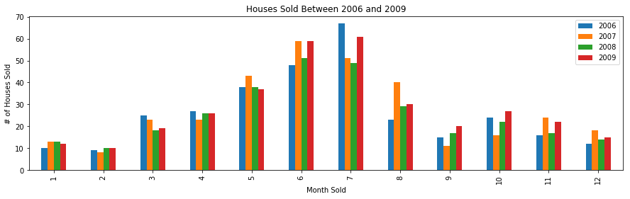
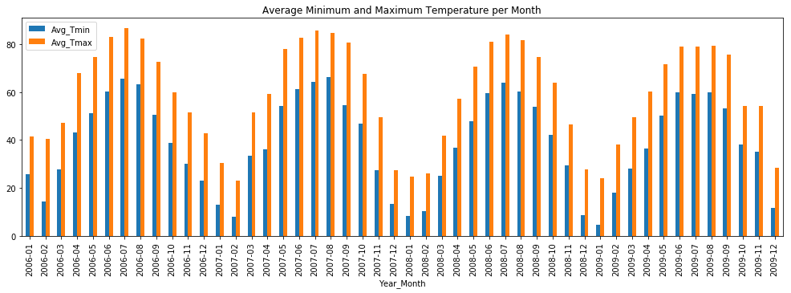
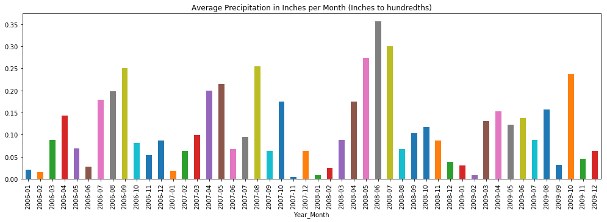
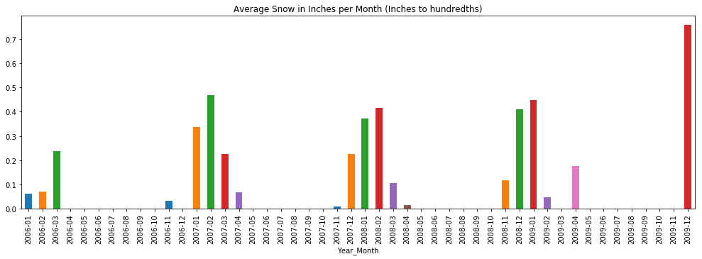
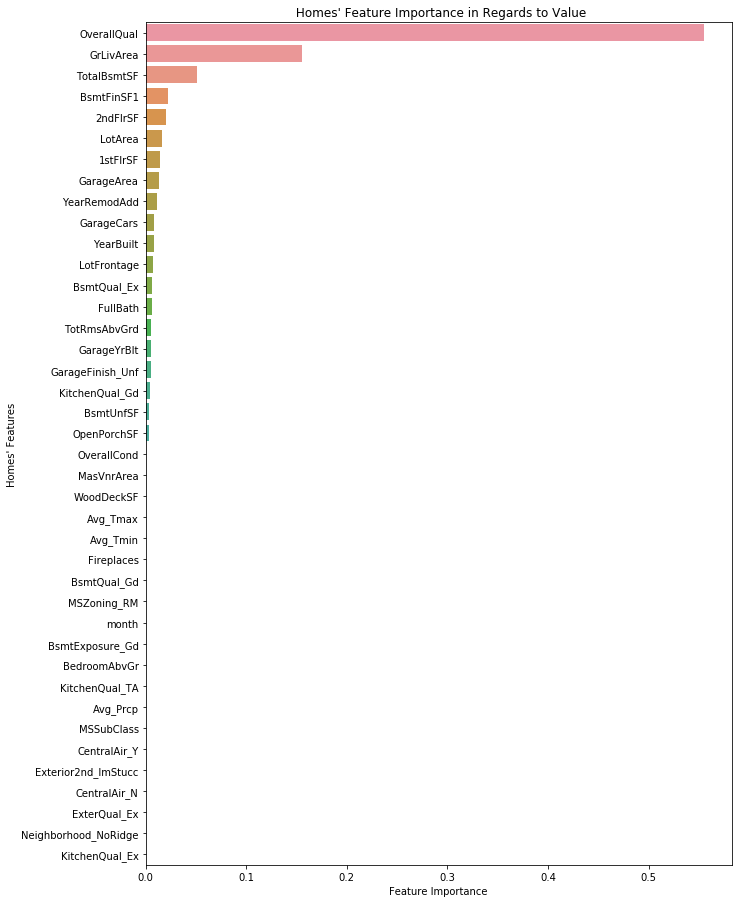

---
## Price Prediction

In this project, I analyzed data related to the sale price of homes, besides homes' features, I combined different types of weather data points to investigate how strong of relationship weather around the year holds against homes' sale prices.

## Some of the findings include:
- The tendency of people to buy more homes during the spring and summer months.
- Specific homes' features such as the quality of homes, size of living area, and a total basement area showed the strongest importance related to home prices.
- Weather doesn't seem to drive home prices in homes as much as several other features. Weather ranks its self further down to the 24th place in feature importance.

---
# Charts

### Home Sales

### Temperatures

### Precipitation

### Snow

### Feature Importance

## Installation

### Download the data

* Clone this repository to your computer
* Access repository through the jupyter notebook
* Excecute the code